<script src="drawTM.js"></script>
# Formal verification of the 5th Busy Beaver value

{.author}
Tristan Stérin, Maja Kądziołka  
bbchallenge.org

{pause up-at-unpause}
## The busy beaver function

{.has-biopic}
> {.biopic}
>  **Tibor Radó**, 1895 — 1965
>
> {.for-biopic}
> > {.definition}
> > > $BB(n)$: maximum number of steps done by a halting 2-symbol Turing machine
> > > with $n$ states starting from an all-0 tape.
> > 
> > {.cite}
> > T. Radó. On Non-computable Functions. Bell System Technical Journal, 41(3):877–884. 1962. {pause}
> >
> > {.informal #bang4buck}
> > BB(n) = "Maximum algorithmic bang for your buck" {pause}
> >
> > {.informal .stamp}
> > UNCOMPUTABLE {pause up-at-unpause=bang4buck}

{#initial-example-tm}

{#initial-example-tape}

{pause exec-at-unpause}
```slip-script
const tm = fromStandard('1RB0LC_1LA0RC_1RA---');
let x = drawTM('#initial-example-tm', tm);
initialExec = execTM('#initial-example-tape', tm, '#initial-example-tm');
return {
    undo() {
        x.undo();
        initialExec.undo();
    }
}
```

{pause exec-at-unpause}
```slip-script
return initialExec.executeStep();
```

{pause exec-at-unpause}
```slip-script
return initialExec.executeStep();
```

{pause exec-at-unpause}
```slip-script
return initialExec.executeStep();
```

{pause exec-at-unpause}
```slip-script
return initialExec.executeStep();
```

{pause exec-at-unpause}
```slip-script
return initialExec.executeStep();
```

{pause exec-at-unpause}
```slip-script
return initialExec.executeStep();
```

{pause exec-at-unpause}
```slip-script
return initialExec.executeStep();
```

{pause exec-at-unpause}
```slip-script
return initialExec.executeStep();
```

{pause exec-at-unpause}
```slip-script
return initialExec.executeStep();
```

{pause exec-at-unpause}
```slip-script
return initialExec.executeStep();
```

{pause}

{.has-biopic}
> {.biopic .unrevealed #winner-spacetime}
> 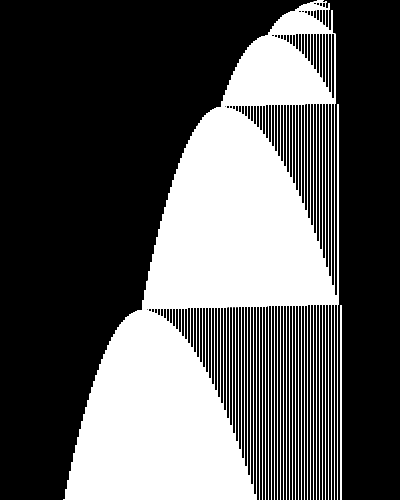 **BB(5) winner**, first 20,000 steps
>
> {.for-biopic}
> {#small-values}
> > Small busy beaver values:
> > <ul>
> > <li>BB(1) = 1, BB(2) = 6 <span class="cite-list">[Radó, 1962]</span></li>
> > <li>BB(3) = 21           <span class="cite-list">[Radó and Lin, 1963]</span></li>
> > <li>BB(4) = 107          <span class="cite-list">[Brady, 1983]</span></li>
> > <li id="bb5a" class="unrevealed">BB(5) &geq; 47,176,870
> >     <span class="cite-list">[Marxen and Buntrock, 1989]</span></li>
> > <li id="bb5b" class="unrevealed">BB(5) = 47,176,870
> >     <span class="cite-list">[bbchallenge, 2024]</span></li>
> > </ul>
> >
> > {#winner-tm}

{pause up-at-unpause=initial-example-tm}

{.indent #bb4-explanation}
> For each 4-state Turing machine, witness that it halts
> within 107 steps, or __prove it never halts__ {pause} (which can be hard{.red} in general)

{pause up-at-unpause=small-values #hardness}
## Mathematical hardness of busy beaver values

Any $\Pi_1$ statement (i.e. $\forall x, P(x)$ for computable $P$) can be converted
into a Turing machine that halts iff the statement is false,
by searching for counterexamples.

{.example title="Goldbach's conjecture, 1742"}
> Every positive even integer $n > 2$ can be written as a sum of two primes.
>
> $4 = 2 + 2 \quad 6 = 3 + 3 \quad 8 = 5 + 3 \quad 10 = 7 + 3 \quad 12 = 7 + 5
> \quad 14 = 11 + 3 \quad \ldots$

{pause up-at-unpause=hardness}

1. Enumerate all even numbers $n$
2. For each $n$, enumerate all primes $p < n$ and test all sums
3. Halt if no sum reaches the current $n$

{pause}

There is a 25-state Turing machine that implements the above.
[[anonymous, 2016]]{.cite} Verified in [Lean]{.tech}! [[lengyijun, 2024]]{.cite}

{pause}

Hence, knowing BB(25) is "at least as hard" as solving Goldbach's conjecture.

{pause}

Other examples:

- Riemann Hypothesis $\rightarrow BB(744)$ [[Matiyassevich and O'Rear, 2016]]{.cite}
- Consistency of ZF $\rightarrow BB(748)$ [[O'Rear, 2017] [Riebel, 2024]]{.cite}

{pause center-at-unpause=bb5a exec-at-unpause}
```slip-script
const stale = document.querySelector('#bb4-explanation');
stale.style.opacity = 0;
return {
    undo() {
        stale.style.opacity = 1;
    }
}
```

{pause reveal-at-unpause=bb5a}

{pause reveal-at-unpause=winner-spacetime exec-at-unpause}
```slip-script
return drawTM('#winner-tm', fromStandard('1RB1LC_1RC1RB_1RD0LE_1LA1LD_1RZ0LA'));
```

{pause up-at-unpause}

## Georgi Georgiev's bbfind program

{.has-biopic}
> {.biopic}
> 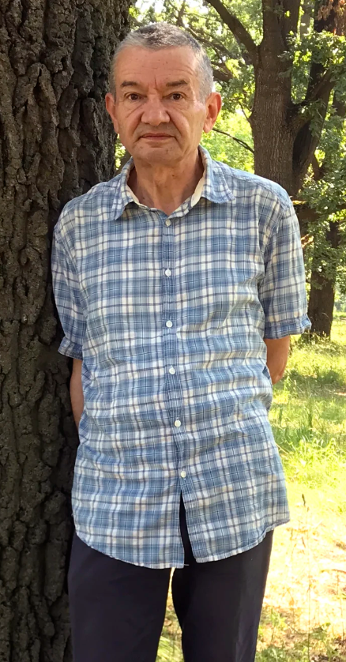 **Georgi "Skelet" Georgiev**
>
> {.for-biopic}
> > In 2003, Georgi Georgiev's ([Skelet]{.keyword}) publishes his **bbfind** program: {pause}
> > 
> > - solves all 5-state machines except ~150 hard ones {pause}
> >   - best result since 1989 [[Marxen and Buntrock, 1989]]{.cite}
> > - ~6000 lines of undocumented [Pascal]{.tech} code {pause}
> >   - concerns about correctness {pause}
> > - Note: failed to find a better machine {pause}
> >
> > In 2020, Scott Aaronson conjectured that there is **no better machine**:
> > Marxen and Buntrock's machine is the **BB(5) winner**.

{pause center-at-unpause=bb5a}

{pause reveal-at-unpause=bb5b}

{pause up-at-unpause}
## bbchallenge.org: The Busy Beaver Challenge

{.has-biopic}
> {.biopic}
> 
>
> {.for-biopic}
> > - Created by [Tristan]{.cosmo} in 2022
> > - Online, asynchronous, almost exclusively communicating on [Discord]{.tech} {pause}
> > - No "management": [entropically driven research]{.keyword} {pause}
> >   - Even the formal proof happened through a grassroots initiative {pause}
> > - 800+ members on Discord
> > - ~50 active contributors
> > - ~15 contributors whose contributions were directly used in the Coq proof
> > - Galaxy of ~25 GitHub repositories, many languages used:
> >   C++, Python, Rust, Go, Haskell, Pascal, Coq, Lean, Dafny

{pause down-at-unpause}
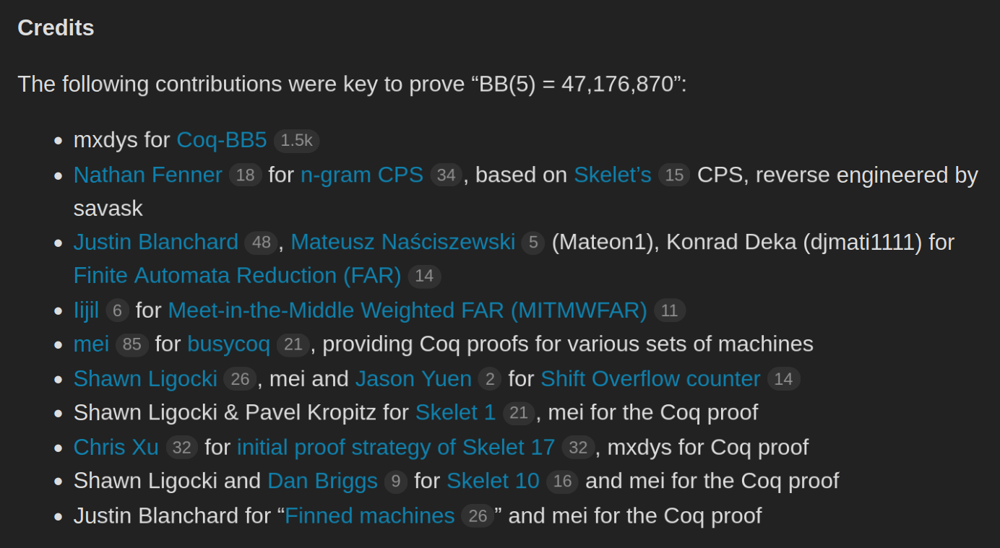

{pause up-at-unpause #proof-outline}
## Proof outline

### 1. Enumerate [all]{#scarequotes} 5-state Turing machines {pause}

- There are $21^{10} \approx 1.67 \cdot 10^{13}$ possible 5-state Turing machines {pause}
- Only $181,385,789$ after symmetries and pruning

{pause exec-at-unpause}
```slip-script
let elem = document.querySelector("#scarequotes");
let oldText = elem.innerText;
elem.innerText = '"' + oldText + '"';
return {undo: () => elem.innerText = oldText};
```

### 2. Try automated proof strategies {pause}

- [Deciders]{.keyword}: programs that, given a TM, output one of

{.verdicts}
> [HALTS]{.verdict .green}
>
> [DOESN'T HALT]{.verdict .blue}
>
> [UNKNOWN]{.verdict .red} {pause}
> $\Downarrow$  
> try another decider {pause}

```math
\forall \mathrm{tm}. \mathrm{decider}(\mathrm{tm}) = \mathtt{NONHALT} \Longrightarrow \text{tm doesn't halt}
```

{pause}

### 3. Manually inspect what's left {pause}

- [Holdouts]{.keyword}: machines that the decider pipeline couldn't deal with
  - Usually the most interesting ones

<!-- TODO: some visualizers here? -->

{pause up-at-unpause exec-at-unpause="draw-iso1"}
## 1. Efficient TM enumeration

Naive enumeration has many redundant machines:

- states can be renamed and rearranged without change of behavior {pause}

  {.compare-tms}
  > {#iso1}
  >
  > {#iso2}

{pause exec-at-unpause="draw-iso2"}

{pause exec-at-unpause="draw-unreachable" #diff-unreachable}
- machines can differ in unreachable parts of their code

  {.compare-tms}
  > {#unreachable-static}
  >
  > {#unreachable}

{pause up-at-unpause=diff-unreachable}

{.has-biopic #tnf-soln}
> {.biopic}
>  **Allen Brady**, 1934 — 2024
>
> {.for-biopic}
> > Solution: enumerate-as-you-go, choosing transitions only when the TM actually reaches them.
> > 
> > This is known as [T]{.keyword}ree [N]{.keyword}ormal [F]{.keyword}orm [enumeration]{.keyword} [[Brady, 1966]]{.cite}
> >
> > {pause exec-at-unpause=draw-tnf-root}
> >
> > {#tnf-root}
> >
> > {pause up-at-unpause=tnf-soln exec-at-unpause=draw-exec1}
> >
> > {#exec1}

{#draw-iso1}
```slip-script
return drawTM('#iso1', fromStandard('1RB---_0LC1RE_0LD1LC_1RA1LB_0RB0RA'));
```

{#draw-iso2}
```slip-script
return drawTM('#iso2', fromStandard('1RB---_0LD1RE_1RA1LB_0LC1LD_0RB0RA'), colors2);
```

{#draw-unreachable}
```slip-script
let x = drawTM('#unreachable', fromStandard('0RB0LC_1LA1RB_1RB---_------_------'), colors1, unreachable='#888');
let y = drawTM('#unreachable-static', fromStandard('0RB0LC_1LA1RB_1RB---_------_------'), colors1, unreachable='#888');

startUnreachableAnim = () => {
    unreachableAnimInterval = setInterval(() => {
        let txs = document.querySelectorAll('#unreachable .unreachable');
        for (let tx of txs) {
            let sym = randomChoice('01');
            let dir = randomChoice('LR');
            let st = randomChoice('ABCDE');
            tx.innerText = sym+dir+st;
        }
    }, 100);
}

startUnreachableAnim();

return {undo() {x.undo(); y.undo(); clearInterval(unreachableAnimInterval);}};
```

{#draw-tnf-root}
```slip-script
return drawTM('#tnf-root', {'0A': '1RB'});
```

{#draw-exec1}
```slip-script
return exec1 = execTM('#exec1', {'0A': '1RB'}, '#tnf-root');
```

{pause exec-at-unpause}
```slip-script
clearInterval(unreachableAnimInterval);
const x = exec1.executeStep();
return {
    undo() {
        x.undo();
        startUnreachableAnim();
    }
}
```

{pause}

Options for the next transition: $\{\mathtt 0, \mathtt 1\} \times \{\mathtt L, \mathtt R\} \times \{\mathtt A, \mathtt B, \mathtt C\}$

{#tnf-row1 .tnf-row}

{pause exec-at-unpause up-at-unpause=tnf-root}
```slip-script
const tms = `
1RB---_0LA---_------_------_------,halt
1RB---_1LA---_------_------_------,halt
1RB---_0RA---_------_------_------,nonhalt
1RB---_1RA---_------_------_------,nonhalt
1RB---_0LB---_------_------_------,halt
1RB---_1LB---_------_------_------,halt
1RB---_0RB---_------_------_------,nonhalt
1RB---_1RB---_------_------_------,nonhalt
1RB---_0LC---_------_------_------,halt
1RB---_1LC---_------_------_------,halt
1RB---_0RC---_------_------_------,halt
1RB---_1RC---_------_------_------,halt
`;

return drawTMs('#tnf-row1', tms);
```

{pause exec-at-unpause}
```slip-script
return revealVerdicts('#tnf-row1');
```

{pause exec-at-unpause}
```slip-script
const row = document.querySelector('#tnf-row1');

for (let i = 0; i < row.children.length; i++) {
    if (i == 1) continue;
    const tm = row.children[i];
    tm.classList.add('unfocused');
}

return {
    undo() {
        for (const tm of row.children) {
            tm.classList.remove('unfocused');
        }
    }
};
```

{#exec2}

{pause exec-at-unpause}
```slip-script
return exec2 = execTM('#exec2', {'0A': '1RB', '0B': '1LA'}, '#tnf-row1 > :nth-child(2)');
```

{pause exec-at-unpause}
```slip-script
return exec2.executeStep();
```

{pause exec-at-unpause}
```slip-script
return exec2.executeStep();
```

{#tnf-row2 .tnf-row}

{pause exec-at-unpause up-at-unpause=tnf-row1}
```slip-script
const tms = `
1RB0LA_1LA---_------_------_------,nonhalt
1RB1LA_1LA---_------_------_------,halt
1RB0RA_1LA---_------_------_------,nonhalt
1RB1RA_1LA---_------_------_------,nonhalt
1RB0LB_1LA---_------_------_------,halt
1RB1LB_1LA---_------_------_------,halt
1RB0RB_1LA---_------_------_------,halt
1RB1RB_1LA---_------_------_------,halt
1RB0LC_1LA---_------_------_------,halt
1RB1LC_1LA---_------_------_------,halt
1RB0RC_1LA---_------_------_------,halt
1RB1RC_1LA---_------_------_------,halt
`;

return drawTMs('#tnf-row2', tms);
```

{pause exec-at-unpause}
```slip-script
return revealVerdicts('#tnf-row2');
```

{pause}

{.informal}
Rinse & repeat&trade; {pause up-at-unpause=tnf-row2}

{#unreasonably-effective}
### [TNF enumeration]{.keyword} is unreasonably effective

- $21^{10} \approx 1.67 \cdot 10^{13}$ possible Turing machines
- Back-of-the envelope calculation: $\frac{21^{10}}{4! \cdot 2 \cdot 2} \approx 1.74 \cdot 10^{11}$ after symmetry
- Actually enumerated: $181,385,789 \approx 1.81 \cdot 10^8$

{pause up-at-unpause=unreasonably-effective}

{#deciding-undecidable}
## 2. Deciding the undecidable: a quick tutorial

{.informal .green}
This is impossible! Let's do it anyway.

{pause up-at-unpause=deciding-undecidable}

<!--
{.mdtable}
| Decider                            | Nonhalt     | Halt       | Total       |
| -----------------------------------| ----------- | ---------- | ----------- |
| Loops                              | 126,994,099 | 48,379,711 | 175,373,810 |
| n-gram Closed Position Set         | 6,005,142   |            | 6,005,142   |
| Repeated Word List                 | 6,577       |            | 6,577       |
| Halt Max (47,176,870 steps)        | 0           | 183        | 183         |
| Finite Automata Reduction          | 23          |            | 23          |
| Weighted Finite Automata Reduction | 17          |            | 17          |
| Sporadic Machines                  | 13          |            | 13          |
| 1RB reduction ([see below](#table_based-and-normal_form_table_based))                 | 14          |            | 14          |
| Total                              | 133,005,895 | 48,379,894 | 181,385,789 |
-->

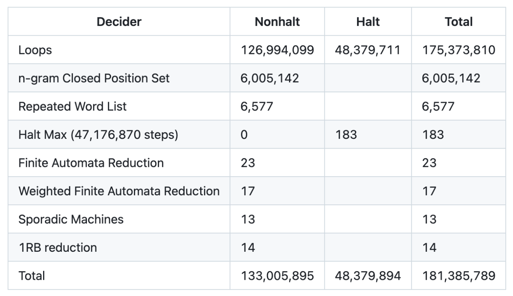 {pause}

{#idea-cyclers}
### Simplest idea: there's gotta be *some* TMs that just enter a cycle

{.tm-and-spacetime}
> {#tm-cycler}
>
> {#exec-cycler .with-history}

{pause exec-at-unpause up-at-unpause=idea-cyclers}
```slip-script
const tm = fromStandard("1RB0RB_1LC1RC_0LD0LD_1RE1LA_1RD---");

const drawit = drawTM('#tm-cycler', tm);
execCycler = execTM('#exec-cycler', tm, '#tm-cycler');

return {
    undo() {
        execCycler.undo();
        drawit.undo();
    }
};
```

{pause exec-at-unpause up-at-unpause=idea-cyclers}
```slip-script
return execCycler.animateSteps(13);
```

{pause exec-at-unpause}
```slip-script
async function doit() {
    await skipAnimation();
    execCycler.setHighlightRule((i, n) => (i + 3) % 8 == 0);
    const tape1 = document.querySelector('#exec-cycler .tape-outer:nth-child(6)');
    tape1.classList.add('highlighted');
    const tape2 = document.querySelector('#exec-cycler .tape-outer:nth-child(14)');
    tape2.classList.add('highlighted');
}

doit();

return {
    undo() {
        const tape1 = document.querySelector('#exec-cycler .tape-outer:nth-child(6)');
        tape1.classList.remove('highlighted');
        const tape2 = document.querySelector('#exec-cycler .tape-outer:nth-child(14)');
        tape2.classList.remove('highlighted');
        execCycler.setHighlightRule((i, n) => i == n);
    }
};
```

{pause exec-at-unpause}
```slip-script
const elem = document.querySelector('#exec-cycler');
elem.classList.add('shrink');

const tape1 = document.querySelector('#exec-cycler .tape-outer:nth-child(6)');
tape1.classList.remove('highlighted');
const tape2 = document.querySelector('#exec-cycler .tape-outer:nth-child(14)');
tape2.classList.remove('highlighted');

return {
    undo() {
        elem.classList.remove('shrink');
        tape1.classList.add('highlighted');
        tape2.classList.add('highlighted');
    }
}
```

{pause exec-at-unpause}
```slip-script
return execCycler.animateSteps(29, 25);
```

{pause #idea-tcyclers up-at-unpause exec-at-unpause=run-tcycler}
### A bit more general: [Translated Cyclers]{.keyword}

{.tm-and-spacetime}
> {#tm-tcycler}
>
> {#exec-tcycler .with-history .shrink}

{#run-tcycler}
```slip-script
//const tm = fromStandard("1RB0LE_1LC1LA_1LD1LB_1RB---_0RE1RB");
const tm = fromStandard("1RB---_1LB1LC_0RD0RC_1LE1RE_1LA0LE");

const drawit = drawTM('#tm-tcycler', tm);
execTCycler = execTM('#exec-tcycler', tm, '#tm-tcycler');
execTCycler.setHighlightRule((i, n) => i >= 13 && i % 8 == 5);

return {
    undo() {
        execTCycler.undo();
        drawit.undo();
    }
};
```

{pause exec-at-unpause}
```slip-script
return execTCycler.animateSteps(29 + 13, 25);
```

{pause #tcyclers-however up-at-unpause exec-at-unpause=run-tcycler2}
### However, the tape left behind isn't always clean

{.tm-and-spacetime}
> {#tm-tcycler2}
>
> {#exec-tcycler2 .with-history .shrink .shrink2}

{#run-tcycler2}
```slip-script
//const tm = fromStandard("1RB---_0RC0LB_1RD0RE_1LE1RD_1LC1LB");
//const tm = fromStandard("1RB0RE_1LC---_1RE0RD_0RA1LD_1LB0RE");
const tm = fromStandard("1RB0LB_1LA1LC_0LE1RD_---0RB_0LA1LB");

const drawit = drawTM('#tm-tcycler2', tm);
execTCycler2 = execTM('#exec-tcycler2', tm, '#tm-tcycler2');
execTCycler2.setHighlightRule((i, n) => i % 19 == 0);

return {
    undo() {
        execTCycler2.undo();
        drawit.undo();
    }
};
```

{pause exec-at-unpause}
```slip-script
return execTCycler2.animateSteps(60, 25);
```

{pause up-at-unpause}
### Translated Cyclers

{pause}

- This decider was first used for BB(3) [[Radó and Lin, 1963]]{.cite}
  - originally known as [Lin recurrence]{.keyword} {pause}
- However, we can do better:

{.theorem title="deciding loops by ear"}
> Consider the sequence of (current state, symbol under head) pairs the machine
> visits during its execution. Two repetitions in this sequence are enough
> to declare this machine a (translated) cycler.
>
> *Side conditions apply. Not a legally binding algorithm description. Consult
> a mathematician before use.*

<!-- TODO visualize this maybe -->

{pause #tcyclers-bigger up-at-unpause exec-at-unpause=draw-bigger-tcycler}
### Translated Cyclers can get bigger

{.has-biopic .bigger-biopic}
> {.biopic}
> 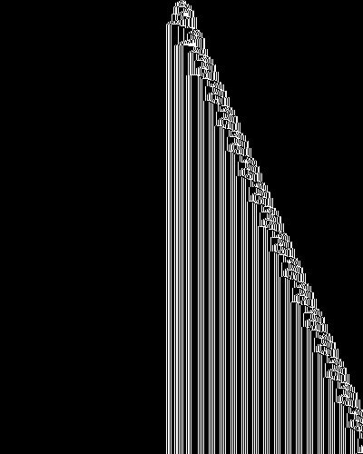 
> 
> {.for-biopic}
> > {#tm-big-TC-table}
> >
> > - 10,000-step space-time diagram 
> > - Behaviour starts after about 1000 steps
> > - Period is about 600 steps

{#draw-bigger-tcycler}
```slip-script
return drawTM('#tm-big-TC-table', fromStandard('1RB0LE_1LC0RD_---1LD_1RE0LA_1LA0RE'));
```

{pause}

{.informal}
They can get a [LOT]{.emph} worse

{pause #skelet-tcycler up-at-unpause}
## Skelet #1, a ginormous Translated Cycler

{.diagram-and-bullets}
> 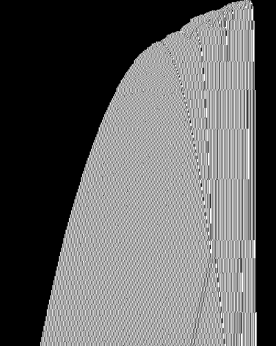
> 
> - Discovered by Georgi Georgiev (a.k.a Skelet) in 2003
> - Behavior starts after $10^{51}$ steps
> - Period of more than 8 billion steps
> - Required an individual Coq proof of nonhalting
> - One of the most complex 5-state TMs

{pause up-at-unpause}

Outside of [Cyclers]{.keyword}, there are two strategies: {pause}

{.has-biopic}
> {.biopic}
> 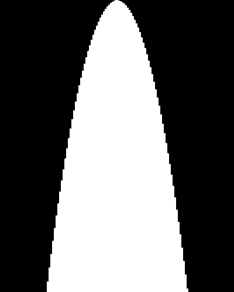
> Example of a **Bouncer**, one such concrete class
>
> {.for-biopic}
> > 1. choose a specific class of machines, tailor a decider to recognize them
> >   {pause}
> > 2. generic methods that attempt to approximate the behavior in some way
> >   ([abstract interpretation]{.keyword})

{pause exec-at-unpause}
```slip-script
cpsTapeExampleContents = [0, 1, 1, 0, 1, 0, 1, 1, 0, 1, 0, 1, 1, 0, 1];
return cpsTape = inertTape('#cps-tape', 'A', cpsTapeExampleContents);
```

{#section-cps}
## [$n$-gram]{.keyword} [C]{.keyword}losed [P]{.keyword}osition [S]{.keyword}et {pause up-at-unpause}

{#cps-tape .extra-border .wide}

{pause exec-at-unpause}
```slip-script
const tape = document.querySelectorAll('#cps-tape .tape-cell');
const tapeSize = tape.length;
const n = 3;
const position = Math.floor(tapeSize / 2);
const revealedL = position - n;
const revealedR = position + n;

for (let i = 0; i < revealedL; i++) {
    tape[i].classList.add('cps-masked');
}

for (let i = revealedR + 1; i < tapeSize; i++) {
    tape[i].classList.add('cps-masked');
}

return {
    undo() {
        for (let i = 0; i < revealedL; i++) {
            tape[i].classList.remove('cps-masked');
        }

        for (let i = revealedR + 1; i < tapeSize; i++) {
            tape[i].classList.remove('cps-masked');
        }
    }
}
```

{pause exec-at-unpause}
```slip-script
cpsTape.setPosition(8);
cpsTape.enterState('B');
return {
    undo() {
        cpsTape.setPosition(7);
        cpsTape.enterState('A');
    }
}
```

{pause exec-at-unpause}
```slip-script
const cell = document.querySelector('#cps-tape .tape-cell:nth-child(12)');

cell.classList.add('mystery');

return {
    undo() {
        cell.classList.remove('mystery');
    }
}
```

{#cps-tape2 .extra-border .wide .extra-space-above}

{pause exec-at-unpause up-at-unpause=section-cps}
```slip-script
cpsTape2 = inertTape('#cps-tape2', 'A', cpsTapeExampleContents.slice(7), 0);
return cpsTape2;
```

{pause exec-at-unpause}
```slip-script
const n = 3;
const tapeSize = 8;
const container = document.querySelector('#cps-tape2');
const origTape = document.querySelector('#cps-tape2 .tape-outer');
function mkTapeSnippet(position) {
    const snippet = origTape.cloneNode(true);
    container.append(snippet);

    const inner = snippet.querySelector('.tape');
    // we start at -1 to adjust for the tape head being an element
    // that we happen to remove here. this is dirty on multiple accounts
    // but it works so I'm not reworking it
    let marginR = -1;
    // bleh, I don't know a better API off-hand
    while (position + n < inner.children.length) {
        inner.removeChild(inner.children[position + n]);
        marginR++;
    }

    for (let i = 0; i < position; i++) {
        inner.removeChild(inner.children[0]);
    }

    const marginL = position;

    snippet.style.marginRight = `${marginR * 2}em`;
    snippet.style.marginLeft = `${marginL * 2}em`;
}

const skip = animate(async function * () {
    for (let i = 1; i + n <= tapeSize; i++) {
        mkTapeSnippet(i);
        yield 100;
    }

    /*
    let ellipsis = document.createElement('div');
    ellipsis.innerText = '. . .';
    ellipsis.style.textAlign = 'center';
    ellipsis.style.fontSize = '32pt';
    ellipsis.style.lineHeight = '0.8em';
    container.append(ellipsis);
    */
});

return {
    undo: async function() {
        await skip();

        while (container.children.length > 1) {
            container.removeChild(container.children[1]);
        }
    }
}
```

{pause exec-at-unpause}
```slip-script
const cell1 = document.querySelector('#cps-tape .tape-cell:nth-child(12)');
const cell2 = document.querySelector('#cps-tape .tape-cell:nth-child(5)');

cell1.classList.remove('mystery');
cell1.classList.remove('cps-masked');
cell2.classList.add('cps-masked');

return {
    undo() {
        cell1.classList.add('mystery');
        cell1.classList.add('cps-masked');
        cell2.classList.remove('cps-masked');
    }
}
```

{pause exec-at-unpause}
```slip-script
cpsTape.setPosition(9);
cpsTape.enterState('C');
return {
    undo() {
        cpsTape.setPosition(8);
        cpsTape.enterState('B');
    }
}
```

{pause exec-at-unpause}
```slip-script
const cell = document.querySelector('#cps-tape .tape-cell:nth-child(13)');

cell.classList.add('mystery');

return {
    undo() {
        cell.classList.remove('mystery');
    }
}
```

{pause up-at-unpause}
## Machines decided by [$n$-gram CPS]{.keyword}

{.side-by-side}
> 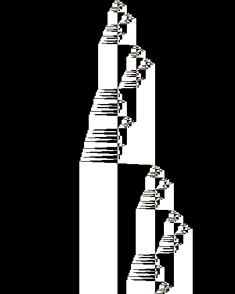
>
> 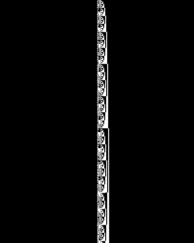

<!-- TODO: highlight the part of the tape being left alone, label $n = 3$ -->

{pause up-at-unpause}
## So, where are we at?
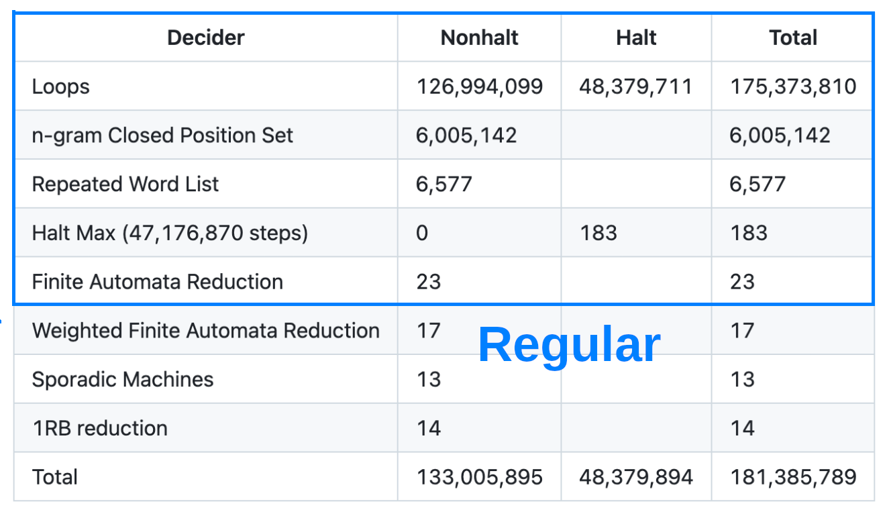

<!--
{pause up-at-unpause}
## General framework: Closed Tape Languages

- $
-->

{pause up-at-unpause}
## 3. What are the holdouts like? {pause}

{.has-biopic}
> {.biopic}
> 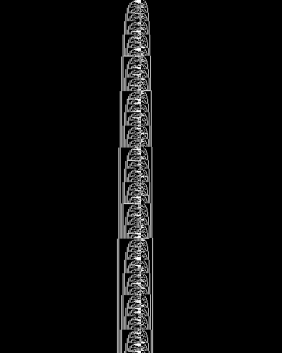 **Skelet #10**: counts in base Fibonacci on two sides of the tape, halts if the two counters are out of sync
>
> {.for-biopic}
> > {.theorem title="counting in base Fibonacci"}
> > > All natural numbers can be expressed as a sum of [Fibonacci numbers]{.keyword}
> > > in exactly
> > > one way, if you forbid using numbers immediately adjacent in the Fibonacci
> > > sequence. {pause}
> > >
> > > ```math
> > > 1, 1, 2, 3, 5, 8, 13, 21, 34, 55, 89, 144
> > > ```
> > >
> > > ```math
> > > 17 = 1 + 3 + 13
> > > ```

{pause up-at-unpause .side-by-side}
>  **Skelet #1**: very chaotic, starts cycling after $10^{51}$ steps
>
> 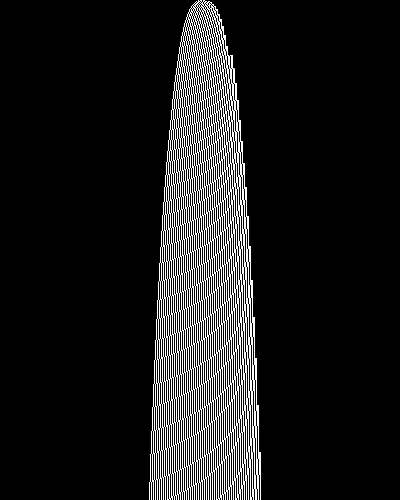 **Skelet #17**: complex discrete math problem involving counting in Gray code [[Chris Xu, 2024, arXiv:2407.02426]]{.cite}

{pause up-at-unpause}
## The formal proof

Initially, formal verification was considered too ambitious and out of scope. {pause}

Original correctness strategy:
  - independent, interoperable implementations of each component
  - consensus-based development
  - modular pipeline with very loose interlinking {pause}
    - in place of the [decider]{.keyword} pipeline, the [TNF enumeration]{.keyword} used a very simple criterion:
      - if it halts within 47,176,870, then it halts
      - otherwise, mark it as undecided

{pause #nathan-dafny}
In 2022, Nathan Fenner wrote formally verified versions of some
of the deciders in [Dafny]{.tech}:
- [F]{.keyword}inite [A]{.keyword}utomata [R]{.keyword}eduction
- Halting Segment (since obsoleted by other work)

{pause up-at-unpause=nathan-dafny}
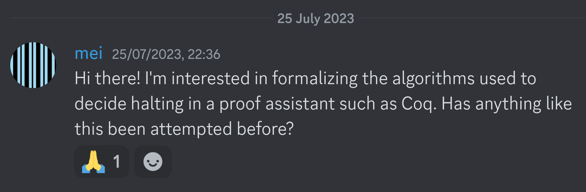

{#enter-mei-stage-left}
In 2023, [mei]{.mei} joins the project. {pause}
- always been meaning to get into formal verification (seemed interesting) {pause}
- previous experience: small stuff in [Isabelle/HOL]{.tech} {pause}
- read Adam Chlipala's **Certified Programming with Dependent Types** and forgot most of it {pause}
- learned [Coq]{.tech} through **Software Foundations** {pause}
- found bbchallenge through OEIS immediately afterwards

{pause up-at-unpause}
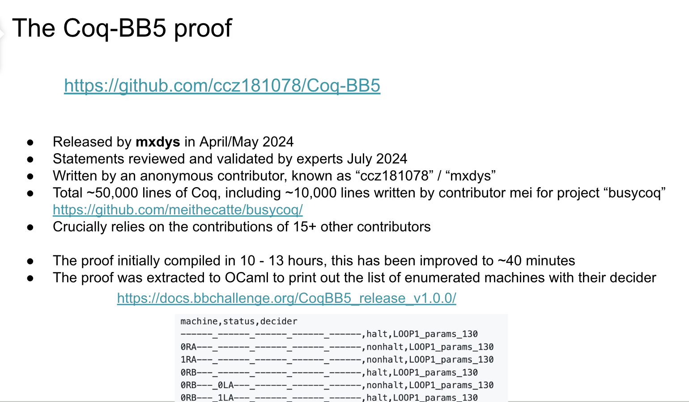


<style>
.author {
    text-align: center;
    font-size: 1.5em;
}

.biopic {
    display: block;
    font-size: 20pt;
    text-align: center;
    order: 2;
}

img {
    width: 100%;
}

.mei {
    color: oklch(0.715 0.143 215.221);
    font-weight: bold;
}

.keyword {
    color: oklch(0.696 0.17 162.48);
    font-weight: bold;
}

.tech {
    color: oklch(0.541 0.281 293.009);
    font-weight: bold;
}

.biopic img {
    width: 100%;
    padding-bottom: 1.5rem;
}

.has-biopic {
    display: grid;
    gap: 3rem;
    grid-template-columns: 2fr 1fr;
}

.bigger-biopic {
    grid-template-columns: 1fr 1fr;
}

.cite, .cite-list {
    font-size: 16pt;
    color: blue;
}

.cite-list {
    position: absolute;
    left: 25rem;
}

.cite-list::before {
    content: " ";
    font-size: 18pt;
}

.informal {
    color: oklch(0.75 0.183 55.934);
    text-align: center;
    font-weight: bold;
    font-size: 32pt;
}

.emph {
    font-size: 38pt;
}

.red {
    color: red;
}

.green {
    color: green;
}

.blue {
    color: blue;
}

.verdict {
    font-weight: bold;
    font-family: monospace;
    font-size: 32pt;
    text-align: center;
    display: block;
}

.verdicts {
    display: grid;
    grid-template-columns: 1fr 1fr 1fr;
    text-align: center;
}

.compare-tms {
    display: grid;
    grid-template-columns: 1fr 1fr;
    text-align: center;
}

.diagram-and-bullets {
    display: grid;
    grid-template-columns: 1fr 1fr;
    text-align: left;
}

.stamp {
    color: red;
    font-family: monospace;
    padding-top: 2rem;
    transform: rotate(-25deg);
}

.slip-body {
    position: relative;
}

.indent {
    margin-left: 10rem;
}

ul {
    line-height: 1.6;
}

/* TM tables */
.tm-table {
    font-family: monospace;
    background: #111827;
    color: white;
    padding: 0.5rem;
    line-height: 1.3;
    margin: 0 auto;
    text-align: center;
}

.tm-table td, .tm-table th {
    padding: 0 0.5rem;
    border: 2px solid transparent;
}

.active-tx {
    border: 2px solid white !important;
}

.tnf-row {
    display: grid;
    grid-auto-flow: column;
    gap: 1rem;
    justify-content: left;
}

.tnf-row .verdict {
    font-size: 28pt;
}

.unfocused tr, .unfocused .verdict {
    opacity: 0.3;
}

/* TM simulation, spacetime diagrams */
.tape-outer {
    padding-top: 2rem;
    margin-bottom: 1rem;
    overflow: hidden;
    display: grid;
    justify-content: center;
    width: 48rem;
}

:is(h1, h2, h3, h4) + :has(.tape-outer) {
    margin-top: -2rem;
}

.tape {
    display: grid;
    grid-auto-flow: column;
    position: relative;
}

.extra-border .tape {
    border: 2px solid black;
}

.extra-border .tape-head {
    width: calc(2em + 4px);
    height: calc(2em + 4px);
    margin-top: -2px;
    margin-left: -2px;
}

.wide .tape-outer {
    width: auto;
}

.tape-cell {
    font-family: monospace;
    width: 2em;
    height: 2em;
    line-height: 2em;
    text-align: center;
    box-sizing: border-box;
}

.tape-cell.zero {
    background-color: black;
    color: white;
}

.tape-head {
    position: absolute;
    width: 2em;
    height: 2em;
    border: 0.3em solid var(--state-color);
    box-sizing: border-box;
}

.tape-head::before {
    width: 100%;
    display: inline-block;
    text-align: center;
    transform: translateY(-100%);
    margin-bottom: 0.5rem;
    color: var(--state-color);
    content: var(--state);
    /*text-shadow: 2px 2px white, -2px -2px white, 2px -2px white, -2px 2px white;*/
    font-weight: bold;
    font-family: monospace;
}

.with-history .tape-head::before {
    display: none;
}

.previous .tape-cell.zero {
    background-color: #4d4d4d;
}

.tape-outer.highlighted::after {
    content: "← SAME";
    font-size: 28pt;
    font-family: monospace;
    font-weight: bold;
    position: absolute;
    right: -1rem;
    line-height: 4rem;
    color: green;
}

.state-A {
    --state-color: #ff0000;
    --state: "A";
}

.state-B {
    --state-color: #ff8000;
    --state: "B";
}

.state-C {
    --state-color: #0000ff;
    --state: "C";
}

.state-D {
    --state-color: #00ff00;
    --state: "D";
}

.state-E {
    --state-color: #ff00ff;
    --state: "E";
}

.tm-and-spacetime {
    display: grid;
    grid-template-columns: 1fr 3fr;
}

.with-history {
    height: 60rem;
}

.with-history .tape-outer {
    margin-top: -2rem;
    margin-bottom: 0;
}

.shrink {
    --transition: 0.3s ease-out;
    font-size: 8pt;
    transition: font-size var(--transition);
}

.shrink .tape-cell {
    color: transparent;
    transition: color var(--transition);
}

.shrink .tape-head {
    border-width: 1em;
    background-color: var(--state-color);
    transition: border-width var(--transition);
    transition: background-color 0.3s step-end;
}

.shrink.shrink2 {
    font-size: 6pt;
}

.shrink.shrink3 {
    font-size: 4pt;
}

/* CPS specific */
.tape-cell.cps-masked {
    position: relative;
}

.tape-cell::after {
    position: absolute;
    width: 2em;
    height: 2em;
    left: 0;
    top: 0;
    content: "?";
    font-weight: bold;
    /* TODO(lowbrained): maybe a diagonal-striped background here? */
    background-color: #888;
    color: white;
    opacity: 0;
}

.tape-cell.cps-masked::after {
    opacity: 1;
    transition: opacity 0.3s ease-in-out;
}

.tape-cell.cps-masked.mystery::after {
    background-color: violet;
}

.extra-space-above {
    margin-top: 4rem;
}

#cps-tape2 .tape-outer:not(:first-child) {
    padding-top: 0.5rem;
}

#cps-tape2 {
    padding-left: 14em;
    height: calc((2em + 3rem) * 5 + 1rem);
}

.mdtable {
    gap: 0;
}

.mdtable td {
    border: 1px solid black;
}

.theorem {
    font-style: inherit;
}

.side-by-side {
    display: grid;
    grid-template-columns: 1fr 1fr;
    gap: 3rem;
    text-align: center;
}
</style>
