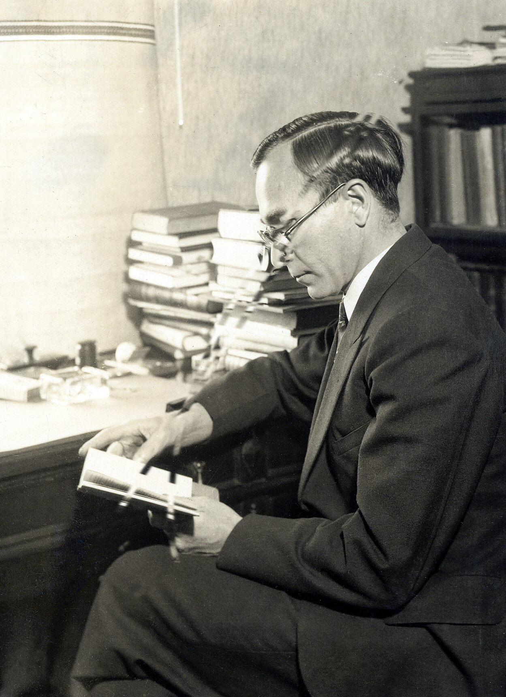
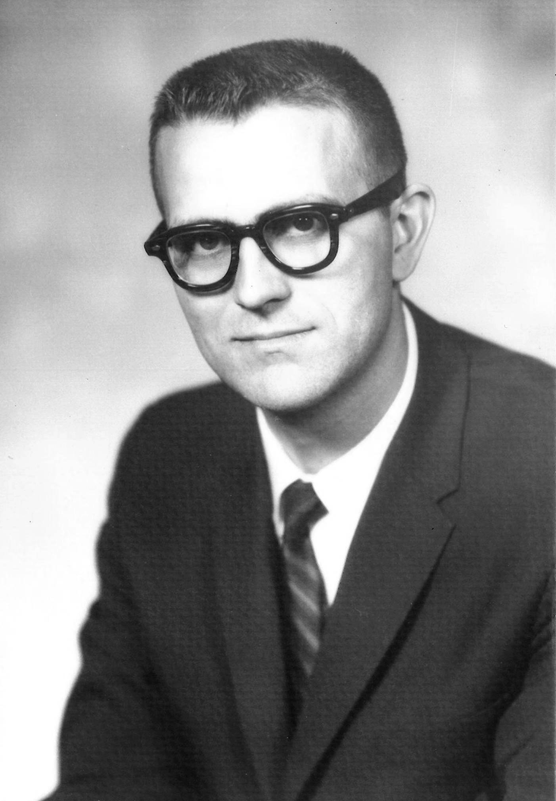

<script src="drawTM.js"></script>
# Formal verification of the 5th Busy Beaver value

{.author}
Tristan Stérin, Maja Kądziołka  
bbchallenge.org

{pause up-at-unpause}
## The busy beaver function

{.has-biopic}
> {.biopic}
>  Tibor Radó, 1895 — 1965
>
> {.for-biopic}
> > {.definition}
> > > $BB(n)$: maximum number of steps done by a halting 2-symbol Turing machine
> > > with $n$ states starting from an all-0 tape.
> > 
> > {.cite}
> > T. Radó. On Non-computable Functions. Bell System Technical Journal, 41(3):877–884. 1962. {pause}
> >
> > {.informal #bang4buck}
> > BB(n) = "Maximum algorithmic bang for your buck" {pause}
> >
> > {.informal .stamp}
> > UNCOMPUTABLE {pause up-at-unpause=bang4buck}

{#small-values}
Small busy beaver values:
- BB(1) = 1, BB(2) = 6 [[Radó, 1962]]{.cite-list}
- BB(3) = 21           [[Radó and Lin, 1963]]{.cite-list}
- BB(4) = 107          [[Brady, 1983]]{.cite-list}

{pause}

{.indent}
> For each 4-state Turing machine, witness that it halts
> within 107 steps, or __prove it never halts__ {pause} (which can be hard{.red} in general)

{pause up-at-unpause=small-values #hardness}
## Mathematical hardness of busy beaver values

Any $\Pi_1$ statement (i.e. $\forall x, P(x)$ for computable $P$) can be converted
into a Turing machine that halts iff the statement is false,
by searching for counterexamples.

{.example title="Goldbach's conjecture, 1742"}
> Every positive even integer $n > 2$ can be written as a sum of two primes.
>
> $4 = 2 + 2 \quad 6 = 3 + 3 \quad 8 = 5 + 3 \quad 10 = 7 + 3 \quad 12 = 7 + 5
> \quad 14 = 11 + 3 \quad \ldots$

{pause up-at-unpause=hardness}

1. Enumerate all even numbers $n$
2. For each $n$, enumerate all primes $p < n$ and test all sums
3. Halt if no sum reaches the current $n$

{pause}

There is a 25-state Turing machine that implements the above.
[[anonymous, 2016]]{.cite} Verified in Lean! [[lengyijun, 2024]]{.cite}

{pause}

Hence, knowing BB(25) is "at least as hard" as solving Goldbach's conjecture.

{pause center-at-unpause=small-values}
<!-- TODO
{pause reveal-at-unpause=bb5}
- BB(5) = 47,176,870   [[Marxen and Buntrock, 1989]]{.cite-list}
-->

{pause up-at-unpause #proof-outline}
## Proof outline

### 1. Enumerate [all]{#scarequotes} 5-state Turing machines {pause}

- There are $21^{10} \approx 1.67 \cdot 10^{13}$ possible 5-state Turing machines {pause}
- Only [$181,385,789$]{.green} after symmetries and pruning

{pause exec-at-unpause}
```slip-script
let elem = document.querySelector("#scarequotes");
let oldText = elem.innerText;
elem.innerText = '"' + oldText + '"';
return {undo: () => elem.innerText = oldText};
```

### 2. Try automated proof strategies {pause}

- Deciders: programs that, given a TM, output one of

{.verdicts}
> [HALTS]{.verdict .green}
>
> [DOESN'T HALT]{.verdict .blue}
>
> [UNKNOWN]{.verdict .red} {pause}
> $\Downarrow$  
> try another decider {pause}

### 3. Manually inspect what's left {pause}

- Holdouts: machines with the most interesting behavior

<!-- TODO: some visualizers here? -->

{pause up-at-unpause exec-at-unpause="draw-iso1"}
## Efficient TM enumeration

Naive enumeration has many redundant machines:

- states can be renamed and rearranged without change of behavior {pause}

  {.compare-tms}
  > {#iso1}
  >
  > {#iso2}

{pause exec-at-unpause="draw-iso2"}

{pause exec-at-unpause="draw-unreachable" #diff-unreachable}
- machines can differ in unreachable parts of their code

  {#unreachable}

{pause up-at-unpause=diff-unreachable}

{.has-biopic #tnf-soln}
> {.biopic}
>  Allen Brady, 1934 — 2024
>
> {.for-biopic}
> > Solution: enumerate-as-you-go, choosing transitions only when the TM actually reaches them.
> > 
> > This is known as **Tree Normal Form enumeration** [[Brady, 1966]]{.cite}
> >
> > {pause exec-at-unpause=draw-tnf-root}
> >
> > {#tnf-root}
> >
> > {pause up-at-unpause=tnf-soln exec-at-unpause=draw-exec1}
> >
> > {#exec1}

{#draw-iso1}
```slip-script
return drawTM('#iso1', fromStandard('1RB---_0LC1RE_0LD1LC_1RA1LB_0RB0RA'));
```

{#draw-iso2}
```slip-script
return drawTM('#iso2', fromStandard('1RB---_0LD1RE_1RA1LB_0LC1LD_0RB0RA'), colors2);
```

{#draw-unreachable}
```slip-script
let x = drawTM('#unreachable', fromStandard('0RB0LC_1LA1RB_1RB---_------_------'), colors1, unreachable='#888');
slip.unreachableAnimInterval = setInterval(() => {
    let txs = document.querySelectorAll('#unreachable .unreachable');
    for (let tx of txs) {
        let sym = randomChoice('01');
        let dir = randomChoice('LR');
        let st = randomChoice('ABCDE');
        tx.innerText = sym+dir+st;
    }
}, 100);
return {undo: () => {x.undo(); clearInterval(slip.unreachableAnimInterval);}};
```

{#draw-tnf-root}
```slip-script
return drawTM('#tnf-root', {'0A': '1RB'});
```

{#draw-exec1}
```slip-script
return exec1 = execTM('#exec1', {'0A': '1RB'}, '#tnf-root');
```

{pause exec-at-unpause}
```slip-script
return exec1.executeStep();
```

{pause}

Options for the next transition: $\{\mathtt 0, \mathtt 1\} \times \{\mathtt L, \mathtt R\} \times \{\mathtt A, \mathtt B, \mathtt C\}$

{#tnf-row1 .tnf-row}

{pause exec-at-unpause up-at-unpause=tnf-root}
```slip-script
const tms = `
1RB---_0LA---_------_------_------,halt
1RB---_1LA---_------_------_------,halt
1RB---_0RA---_------_------_------,nonhalt
1RB---_1RA---_------_------_------,nonhalt
1RB---_0LB---_------_------_------,halt
1RB---_1LB---_------_------_------,halt
1RB---_0RB---_------_------_------,nonhalt
1RB---_1RB---_------_------_------,nonhalt
1RB---_0LC---_------_------_------,halt
1RB---_1LC---_------_------_------,halt
1RB---_0RC---_------_------_------,halt
1RB---_1RC---_------_------_------,halt
`;

async function doit() {
    const row = document.querySelector('#tnf-row1');

    for (const line of tms.trim().split('\n')) {
        const [tm, status] = line.split(',');
        const box = document.createElement('div');
        row.append(box);
        drawTM(box, fromStandard(tm));
        const statusLine = document.createElement('span');
        statusLine.classList.add('verdict');
        statusLine.classList.add('unrevealed');
        if (status == 'halt') {
            statusLine.innerText = "HALTS";
            statusLine.classList.add('green');
        } else {
            statusLine.innerText = "DOESN'T\nHALT";
            statusLine.classList.add('blue');
        }
        box.append(statusLine);
        await sleep(100);
    }
}

doit();

return {
    undo: () => {
        const row = document.querySelector('#tnf-row1');
        row.replaceChildren();
    }
};
```

{pause exec-at-unpause}
```slip-script
async function doit() {
    const verdicts = document.querySelectorAll('#tnf-row1 .verdict');
    for (const verdict of verdicts) {
        verdict.classList.remove('unrevealed');
        await sleep(100);
    }
}

doit();

return {
    undo: () => {
        const verdicts = document.querySelectorAll('#tnf-row1 .verdict');
        for (const verdict of verdicts) {
            verdict.classList.add('unrevealed');
        }
    }
};
```

<style>
.author {
    text-align: center;
    font-size: 1.5em;
}

.biopic {
    display: block;
    font-size: 20pt;
    text-align: center;
    order: 2;
}

.biopic img {
    width: 100%;
    padding-bottom: 1.5rem;
}

.has-biopic {
    display: grid;
    gap: 3rem;
    grid-template-columns: 2fr 1fr;
}

.cite, .cite-list {
    font-size: 16pt;
    color: blue;
}

.cite-list {
    position: absolute;
    left: 25rem;
}

.cite-list::before {
    content: " ";
    font-size: 18pt;
}

.informal {
    color: orange;
    text-align: center;
    font-weight: bold;
    font-size: 32pt;
}

.red {
    color: red;
}

.green {
    color: green;
}

.blue {
    color: blue;
}

.verdict {
    font-weight: bold;
    font-family: monospace;
    font-size: 32pt;
    text-align: center;
    display: block;
}

.verdicts {
    display: grid;
    grid-template-columns: 1fr 1fr 1fr;
    text-align: center;
}

.compare-tms {
    display: grid;
    grid-template-columns: 1fr 1fr;
    text-align: center;
}

.stamp {
    color: red;
    font-family: monospace;
    padding-top: 2rem;
    transform: rotate(-25deg);
}

.slip-body {
    position: relative;
}

.indent {
    margin-left: 10rem;
}

ul {
    line-height: 1.6;
}

.tm-table {
    font-family: monospace;
    background: #111827;
    color: white;
    padding: 0.5rem;
    line-height: 1.3;
    margin: 0 auto;
    text-align: center;
}

.tm-table td, .tm-table th {
    padding: 0 0.5rem;
    border-bottom: 2px solid transparent;
}

.active-tx {
    border-bottom: 2px solid white !important;
}

:has(> .tape-outer) {
    position: relative;
}

.tape-outer {
    overflow: hidden;
    position: absolute;
    left: 0;
    right: 0;
    padding-top: 4rem;
    overflow: hidden;
    display: flex;
    justify-content: center;
}

.tape {
    display: grid;
    grid-auto-flow: column;
    position: relative;
}

.tape-cell {
    font-family: monospace;
    width: 4rem;
    height: 4rem;
    line-height: 4rem;
    border: 2px solid black;
    border-right: none;
    text-align: center;
    box-sizing: border-box;
}

.tape-head {
    position: absolute;
    width: 4rem;
    height: 4rem;
    border: 8px solid;
    box-sizing: border-box;
    border-color: var(--state-color);
}

.tape-head::before {
    width: 100%;
    display: inline-block;
    text-align: center;
    transform: translateY(-100%);
    padding-bottom: 0.5rem;
    color: var(--state-color);
    content: var(--state);
}

.state-A {
    --state-color: #ff0000;
    --state: "A";
}

.state-B {
    --state-color: #ff8000;
    --state: "B";
}

.tnf-row {
    display: grid;
    grid-auto-flow: column;
    gap: 1rem;
    justify-content: left;
}

.tnf-row .verdict {
    font-size: 28pt;
}
</style>
